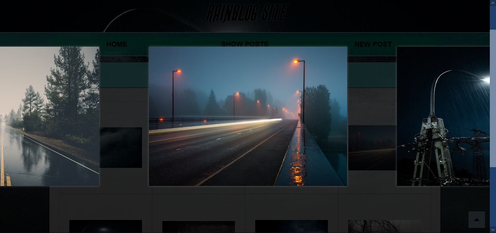
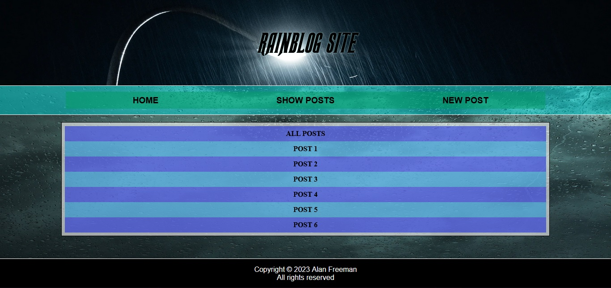

## What is this?
A bloging site centred on images of rain. You can view posts via infinite scrolling, or see each post as a seperate page. There is also an image modal and thumbnail images are generated via the backend. You can also login to 'build' your own posts that will be validated; as well as edit and delete pre-existing posts. These changes will not actually be saved however.

[Click here to try it out](https://rainblog.onrender.com/)

## IMAGES

  

  

  

